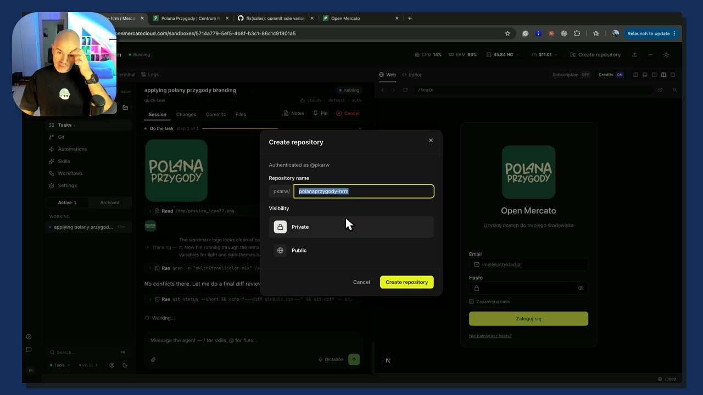
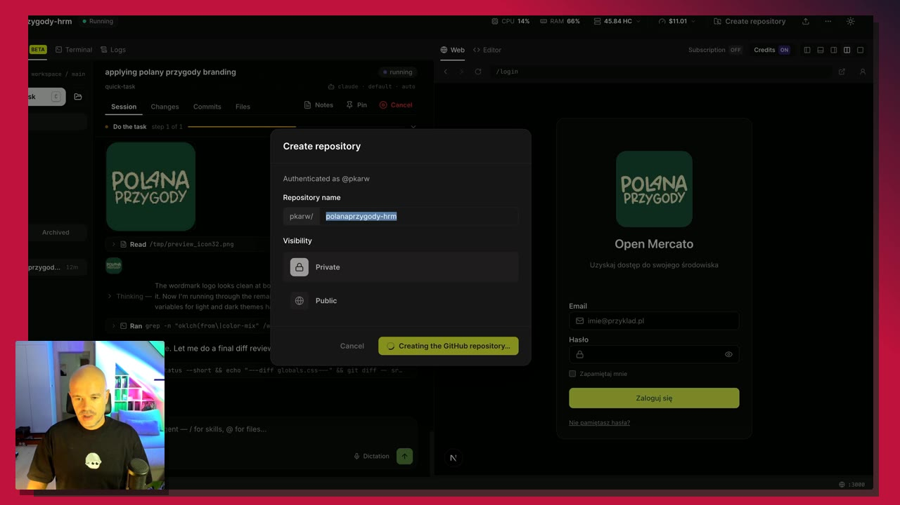
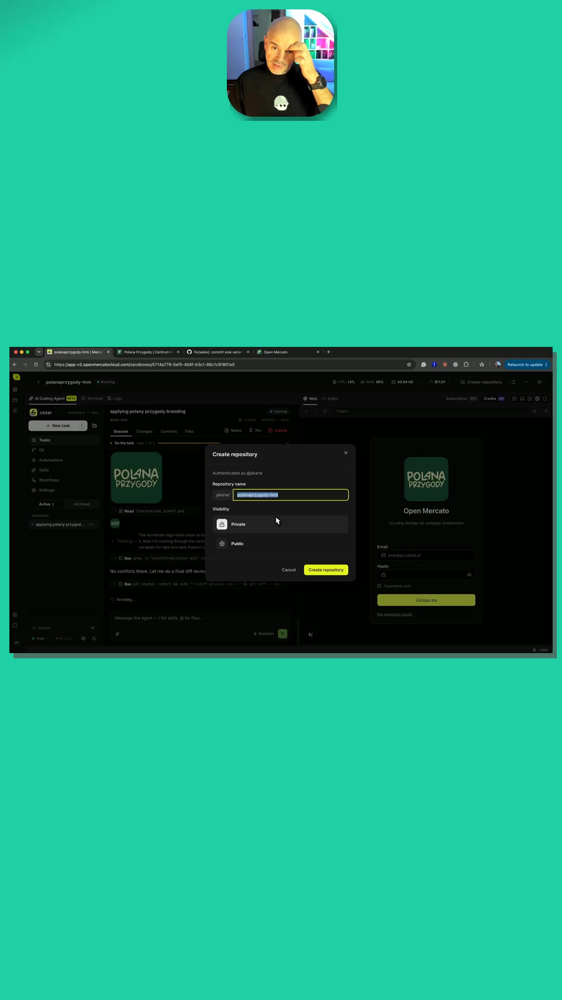
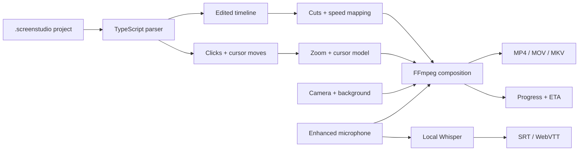

<p align="center">
  
</p>

<h1 align="center">Screen Studio Source Renderer</h1>

<p align="center">
  <a href="https://github.com/pkarw/screenstudio-source-renderer/actions/workflows/test.yml"></a>
  
  
  
  
</p>

Render a native `.screenstudio` project from the command line. The TypeScript CLI rebuilds the edited timeline, enhanced audio, camera, mouse cursor, click-following zooms and background with FFmpeg. It can also extract SRT and WebVTT captions locally with the Whisper model already installed by Screen Studio.

Screen Studio stays closed. Source projects stay untouched.

```text
Rendering  ███████████████░░░░░░░░░  64.2%  09:08 / 14:14  59.8 fps  1.01x  ETA 05:03
```

## What it looks like

| Rounded camera, cursor and zoom | Square camera and gradient |
|---|---|
|  |  |

<p align="center">
  
  <br><em>Portrait output with a custom image background and custom camera location.</em>
</p>

These are frames from real renders produced by this repository, not design mockups.

## Highlights

- Rebuilds multiple recorder sessions, non-destructive cuts and speed changes.
- Uses Screen Studio's enhanced microphone track when available.
- Reconstructs saved click-following, manual and instant zooms.
- Shows the recorded cursor, preserves cursor type changes and follows the zoom crop.
- Supports visible, hidden, resized, cropped, rounded or square camera overlays.
- Supports corner presets and exact custom camera coordinates.
- Uses the saved project background, or a CLI-selected color, gradient or image.
- Creates local SRT, WebVTT or both from the edited audio timeline.
- Renders landscape, portrait, square and fully custom dimensions.
- Writes MP4, M4V, MOV or MKV with a selectable FFmpeg encoder.
- Shows percent, media time, FPS, speed and smoothed ETA.
- Defaults to **UHD 4K, 3840×2160 at 60 fps**.

## Requirements

- macOS with Node.js 20 or newer
- FFmpeg and ffprobe available on `PATH`
- a Screen Studio 3.7.x source project directory
- Screen Studio's local Whisper binary/model for the `subtitles` command, or your own `whisper-cli` and ggml model

The built CLI has no npm runtime dependencies. TypeScript and Node type declarations are development dependencies.

## Install

```bash
git clone https://github.com/pkarw/screenstudio-source-renderer.git
cd screenstudio-source-renderer
npm ci
npm run build
npm link
```

`npm link` makes the `ss-render` command available in your shell. You can use `node dist/src/cli.js` instead if you do not want a global link.

## Quick start

```bash
ss-render inspect "$HOME/Screen Studio Projects/my-recording.screenstudio"

ss-render render "$HOME/Screen Studio Projects/my-recording.screenstudio" \
  --output "$HOME/Renders/my-recording.mp4"
```

The second command creates a 4K/60 MP4 with the camera, cursor, background and zooms read from the source project.

## Camera, cursor and backgrounds

Use project settings unchanged:

```bash
ss-render render project.screenstudio --output lesson.mp4
```

Force a large square camera in the lower-left corner and hide the cursor:

```bash
ss-render render project.screenstudio \
  --camera visible \
  --camera-size 0.42 \
  --camera-zoom 1.25 \
  --camera-position bottom-left \
  --square-camera \
  --no-cursor \
  --background-gradient '#5a1018,#17070a' \
  --output square-camera.mp4
```

Use rounded corners, a larger cursor and a precise camera location:

```bash
ss-render render project.screenstudio \
  --rounded-camera \
  --camera-radius 0.22 \
  --camera-size 0.28 \
  --camera-x 0.08 \
  --camera-y 0.10 \
  --cursor visible \
  --cursor-scale 1.4 \
  --background-color '#142d5c' \
  --output rounded-camera.mp4
```

Custom `--camera-x` and `--camera-y` values run from `0` at the top/left safe edge to `1` at the bottom/right safe edge. They override `--camera-position` independently. A background image is fitted with a centered cover crop:

```bash
ss-render render project.screenstudio \
  --preset vertical \
  --camera-x 0.5 --camera-y 0 \
  --background-image artwork.png \
  --output vertical.mov
```

## Extract subtitles

Subtitles are generated from the same enhanced audio, cuts and speed changes used by the video render. Processing stays local.

```bash
ss-render subtitles project.screenstudio \
  --output lesson.srt \
  --language pl \
  --model small \
  --prompt 'Open Mercato, Open Mercato Cloud, ERP, GitHub' \
  --format both \
  --overwrite
```

This creates `lesson.srt` and `lesson.vtt`. `base`, `small` and `medium` resolve to Screen Studio's model directory when that model has been downloaded. You can also pass an absolute ggml model path and override the executable with `--whisper-bin`.

## Output presets

| Preset | Dimensions | Typical use |
|---|---:|---|
| `4k` | 3840×2160 | YouTube, course master, default |
| `1440p` | 2560×1440 | high-quality web video |
| `1080p` | 1920×1080 | web export |
| `720p` | 1280×720 | quick review |
| `vertical-4k` | 2160×3840 | high-quality portrait master |
| `vertical` | 1080×1920 | Shorts, Reels, TikTok |
| `square` | 2160×2160 | square social video |

```bash
# YouTube master, equivalent to the default
ss-render render project.screenstudio --preset 4k --output lesson.mp4

# Any even-sized canvas and frame rate
ss-render render project.screenstudio \
  --width 3440 --height 1440 --fps 30 --output ultrawide.mkv
```

The recorded screen is fitted inside the canvas without stretching. The background and camera layout adapt to the selected aspect ratio.

## Preview and dry run

```bash
ss-render render project.screenstudio \
  --preset 1080p \
  --start 105 --duration 12 \
  --output zoom-preview.mp4 \
  --overwrite
```

`--start` and `--duration` refer to the edited output timeline. A preview therefore respects cuts and speed changes.

Use a dry run to inspect all derived decisions without encoding:

```bash
ss-render render project.screenstudio --dry-run --output planned.mp4
```

## CLI reference

```text
ss-render inspect <project.screenstudio>
ss-render render <project.screenstudio> --output <video> [options]
ss-render subtitles <project.screenstudio> --output <captions> [options]

Video
  --preset <name>              4k, 1440p, 1080p, 720p, vertical-4k, vertical, square
  --width <px>                 custom width, overrides preset
  --height <px>                custom height, overrides preset
  --fps <number>               frame rate, default 60
  --start <seconds>            start on edited timeline
  --duration <seconds>         duration on edited timeline
  --encoder <name>             default h264_videotoolbox

Camera
  --camera <mode>              project, visible, hidden
  --camera-size <0.05..0.95>   relative to fitted screen height
  --camera-zoom <1..4>         centered crop inside camera image
  --camera-corners <mode>      project, rounded, square
  --camera-radius <0..0.5>     radius as a camera-size ratio
  --camera-zoom-scale <0.1..2> camera scale during screen zoom
  --camera-position <place>    top-left, top-right, bottom-left, bottom-right
  --camera-x <0..1>            custom horizontal location
  --camera-y <0..1>            custom vertical location
  --rounded-camera             shortcut for rounded corners
  --square-camera              shortcut for square corners

Cursor and background
  --cursor <mode>              project, visible, hidden
  --cursor-scale <0.25..4>     cursor size multiplier
  --no-cursor                  shortcut for hidden cursor
  --background-color <#RRGGBB>
  --background-gradient <#RRGGBB,#RRGGBB>
  --background-image <file>

Subtitles
  --format <srt|vtt|both>
  --language <code|auto>
  --model <base|small|medium|path>
  --prompt <text>
  --whisper-bin <path>

General
  --overwrite                  replace existing output
  --dry-run                    print video render plan without encoding
  --help                       show command help
```

Supported video extensions are `.mp4`, `.m4v`, `.mov` and `.mkv`. Advanced users can choose another installed FFmpeg video encoder, such as `hevc_videotoolbox` or `libx264`.

## Screen Studio feature compatibility

“Supported” means reconstructed from source data or controllable from the CLI. It does not claim pixel-for-pixel parity with Screen Studio's proprietary renderer.

| Screen Studio feature | Status | Notes |
|---|---|---|
| Screen recording | ✅ Supported | All recorder sessions are concatenated in source order. |
| Scene cuts | ✅ Supported | Saved slices and deleted gaps are respected. |
| Speed changes | ✅ Supported | Video, audio, zooms and cursor timing follow `timeScale`. |
| Enhanced microphone | ✅ Supported | Preferred automatically, with original audio fallback. |
| Auto zoom / follow clicks | ✅ Supported | Uses the recorded mouse-down target. |
| Manual zoom | ✅ Supported | Uses the saved manual target point. |
| Instant zoom | ✅ Supported | Uses the saved instant-animation flag. |
| Camera size | ✅ Supported | Project setting or `--camera-size`. |
| Camera crop zoom | ✅ Supported | `--camera-zoom` from 1× to 4×. |
| Camera location | ✅ Supported | Four presets plus independent normalized x/y coordinates. |
| Camera during screen zoom | ✅ Supported | Project setting or `--camera-zoom-scale`. |
| Rounded camera | ✅ Supported | Project setting, preset or custom radius with antialiased edges. |
| Square camera | ✅ Supported | `--square-camera` or `--camera-corners square`. |
| Camera mirroring | ✅ Supported | Reads the saved project setting. |
| Mouse cursor | ◐ Partial | Recorded position and cursor-type changes are preserved; vector artwork approximates macOS cursor images. |
| Hide cursor per slice | ✅ Supported | Reads the saved `hideCursor` value. |
| Solid background | ✅ Supported | Project value or CLI override. |
| Gradient background | ✅ Supported | Project gradient or CLI override. |
| Image background | ✅ Supported | CLI image with centered cover crop. |
| Screen Studio system wallpaper | ◐ Partial | Falls back to the project's gradient unless an image is passed explicitly. |
| Captions / transcript export | ✅ Supported | Local Whisper SRT and WebVTT from the edited timeline. |
| Caption styling burned into video | ❌ Not yet | Subtitle files remain editable and separate. |
| Keystroke overlays | ❌ Not yet | No renderer implementation. |
| Click animations | ❌ Not yet | Clicks currently drive zoom targeting only. |
| Motion blur | ❌ Not yet | No renderer implementation. |
| Device mockups | ❌ Not yet | No renderer implementation. |
| Voice-over tracks | ❌ Not yet | Microphone track only. |

## How it works



The verified bundle notes in [docs/FORMAT.md](docs/FORMAT.md) explain how session time, pointer coordinates, slices and zoom ranges map to output.

## Development

```bash
npm ci
npm test
npm run check
```

`npm test` compiles the TypeScript project before running the Node test suite. Project conventions and the mandatory real-render verification matrix live in [AGENTS.md](AGENTS.md).

## Safety

The parser only reads input `.screenstudio` directories. Temporary manifests, masks, audio and cursor tracks are written under the operating system's temporary directory. A source bundle is never edited, renamed or deleted.
