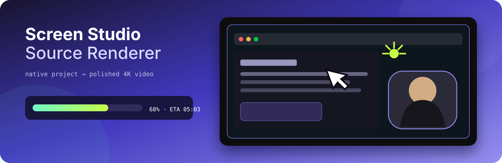
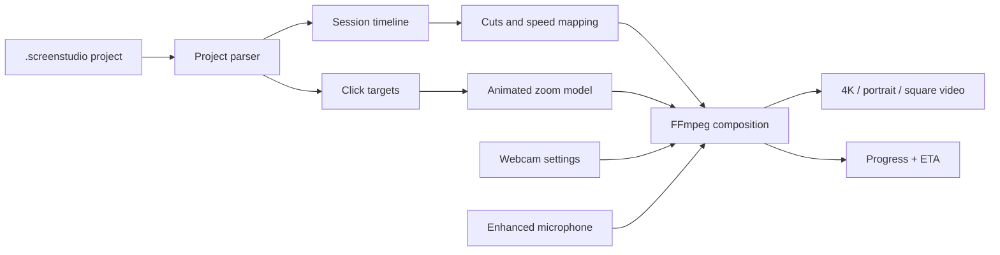

<p align="center">
  
</p>

<h1 align="center">Screen Studio Source Renderer</h1>

<p align="center">
  <a href="https://github.com/pkarw/screenstudio-source-renderer/actions/workflows/test.yml"></a>
  
  
  
</p>

Render a native `.screenstudio` project directly with FFmpeg. The CLI rebuilds the edited timeline, enhanced audio, click-following zooms and rounded webcam composition saved by Screen Studio, while showing a useful live progress bar and ETA.

Screen Studio stays closed. Source projects stay untouched.

```text
Rendering  ███████████████░░░░░░░░░  64.2%  09:08 / 14:14  59.8 fps  1.01x  ETA 05:03
```

## Why this exists

Screen Studio produces beautiful screen recordings, but long 4K exports can become a bottleneck. Its project directories already contain standard media, an edit timeline, click data and visual settings. This project turns that source data into a repeatable, scriptable render pipeline.

## Highlights

- Rebuilds multiple recorder sessions and non-destructive scene cuts.
- Uses Screen Studio's enhanced microphone track when it exists.
- Reconstructs every saved zoom from the real recorded click position.
- Eases and clamps animated crops so the frame never leaves the screen.
- Crops, mirrors, rounds, shadows and positions the webcam from project settings.
- Shrinks the webcam during zooms using `cameraScaleDuringZoom`.
- Renders landscape, portrait, square and fully custom dimensions.
- Writes MP4, M4V, MOV or MKV with a selectable FFmpeg encoder.
- Shows percent, media time, FPS, speed and smoothed ETA.
- Supports fast previews and dry-run inspection before a long encode.

## Requirements

- macOS with Node.js 20 or newer
- FFmpeg and ffprobe available on `PATH`
- a Screen Studio 3.7.x source project directory

There are no npm runtime dependencies.

## Quick start

```bash
git clone https://github.com/pkarw/screenstudio-source-renderer.git
cd screenstudio-source-renderer

node src/cli.js inspect \
  "$HOME/Screen Studio Projects/my-recording.screenstudio"

node src/cli.js render \
  "$HOME/Screen Studio Projects/my-recording.screenstudio" \
  --output "$HOME/Renders/my-recording.mp4"
```

The default is **UHD 4K, 3840×2160 at 60 fps** using Apple VideoToolbox H.264.

## Output presets

| Preset | Dimensions | Typical use |
|---|---:|---|
| `4k` | 3840×2160 | YouTube, course master, default |
| `1440p` | 2560×1440 | high quality web video |
| `1080p` | 1920×1080 | smaller, faster web export |
| `720p` | 1280×720 | quick review |
| `vertical-4k` | 2160×3840 | high quality portrait master |
| `vertical` | 1080×1920 | Shorts, Reels, TikTok |
| `square` | 2160×2160 | square social video |

```bash
# YouTube master, equivalent to the default
node src/cli.js render project.screenstudio --preset 4k --output lesson.mp4

# Portrait social cut
node src/cli.js render project.screenstudio --preset vertical --output short.mov

# Any even-sized canvas and frame rate
node src/cli.js render project.screenstudio \
  --width 3440 --height 1440 --fps 30 --output ultrawide.mkv
```

The screen is fitted inside the requested canvas without stretching. The background and camera layout adapt to the selected aspect ratio.

## Preview before committing to a long render

```bash
node src/cli.js render project.screenstudio \
  --preset 1080p \
  --start 105 --duration 12 \
  --output zoom-preview.mp4 \
  --overwrite
```

`--start` and `--duration` refer to the edited output timeline, not raw recorder time. A preview therefore respects cuts and speed changes.

Use a dry run to inspect all derived decisions without encoding:

```bash
node src/cli.js render project.screenstudio --dry-run --output planned.mp4
```

## Pipeline



The format notes in [docs/FORMAT.md](docs/FORMAT.md) explain how session time, click coordinates, slices and zoom ranges map to the final video.

## CLI reference

```text
ss-render inspect <project.screenstudio>
ss-render render <project.screenstudio> --output <video> [options]

--preset <name>       4k, 1440p, 1080p, 720p, vertical-4k, vertical, square
--width <px>          custom width, overrides preset
--height <px>         custom height, overrides preset
--fps <number>        output frame rate, default 60
--start <seconds>     preview start on the edited timeline
--duration <seconds>  preview duration
--encoder <name>      FFmpeg encoder, default h264_videotoolbox
--overwrite           replace an existing output
--dry-run             inspect the render plan without encoding
```

Supported container extensions are `.mp4`, `.m4v`, `.mov` and `.mkv`. Advanced users can select another locally installed FFmpeg video encoder with `--encoder`, for example `hevc_videotoolbox` or `libx264`.

## Fidelity and current limits

The current renderer reconstructs screen video, webcam, enhanced microphone audio, cuts, time scaling and click-following zooms. It does not yet redraw Screen Studio's enlarged cursor animation, keystroke overlays, motion blur, device mockups or voice-over tracks.

The saved Screen Studio wallpaper is represented by the project's configured gradient. Everything needed for the edit remains local, and the source directory is never modified.

## Development

```bash
npm test
npm run check
```

Project conventions and the mandatory render verification matrix live in [AGENTS.md](AGENTS.md).
